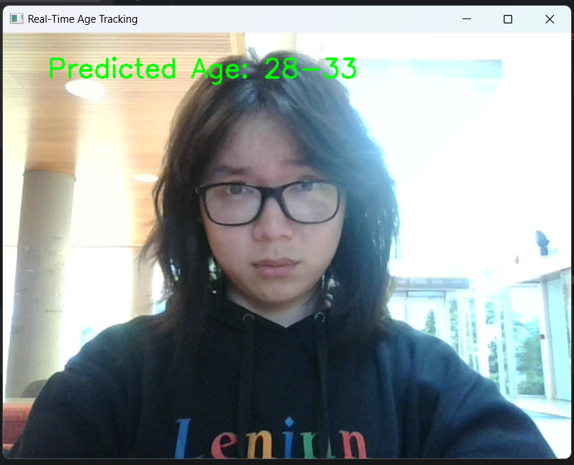

# Age-classfication
 - This project started when I was interested into see how a model that have been trained to an acceptable validation accuracy would classifiy me and my friends at what age
### My edited dataset and model check point
[Data and model](https://drive.google.com/drive/folders/1_8wG8KkBuwocg8D-3hXxvtBLhZFS9f_r?usp=drive_link): put the model files and data fodler in the dir
## Dataset
 - This model is trained on the UTK dataset: https://www.kaggle.com/datasets/jangedoo/utkface-new/code
### Turning point 1:
 - When I first start the project, I opted to train with the number class to be 104 since I wanted to predict absolute age, using the model ResNet50 without any additional layers,
I also did cross validation with different nunber of epochs but kept the same lr and wd (well that was stupid of me, I just started learning machine learning after all), I achieved an average accuracy of around 25% pertentage for each fold (k=5).
 - The model was severely underfitting since without any addtional layers the complexity is too low for 104 classes, at this point of time I thought that maybe I can do hyperparameter tuning with different lr and wd using SGD optimizer
### Turning point 2:
 - This time I experiment with different lr and weight decay, with the same model ResNet50 and it accuracy improved, but not much, it only went up to 40% after 4 days of training with different parameter.
 - I also thought of adding additional layers or even combining models but it increased training time significantly when before it was 30 minutes an epoch.
 - I thought maybe I should opted for predicting age range where the changes in facial featrures are not significant, so I went back to prepare the dataset started with hyperparameter tuning with lr = [0.001, 0.005, 0.0005, 0.00025] and wd = [0.001, 1e-4, 1e-5, 0.003], I also change the model from ResNet50 to EfficientNet_B0 instead as I wanted to see the performance of another model. 
 - Here are the age range that I settled with:
range = [
 '1-2',
 '3-5',
 '6-10',
 '11-14',
 '15-17',
 '18-22',
 '23-27',
 '28-33',
 '34-40',
 '41-50',
 '51-60',
 '61-70',
 '71-80',
 'over80'] coressponding with the number 0 to 13 as I named the folders

### Turning point 3
 - Well the model got even worse so I changed back ResNet50 and this time added Dropout = 0.2 and a additional layers, I also modified the labeling a little bit, all those modifications are done on R (i am not familiar with pandas).
 - I also save the models I used as v1 v2 and v3
 - Since there also lots of imbalance in the dataset, I opted for using confusion matrix instead of accuracy and maximize recall, and I could instantly see the model doing better
  - The model is doing better now but I see some overfitting in the some crossvalidation so I also add early stopping with the patience of 7 so that there is less chance for overfitting in the last training
### Hyperparameter Tuning
- The best hyperparameter is 0.001 and with wd 1e-05, best validation recall: 0.84%, the total running time was 788 minutes 8.58 seconds, epoch loss in this attempt was Loss: 0.4728 and looks very promising.
### First traininng 
 - The final training is done by 50 epochs with early stop loss with 7 patience
 - The loss was decreasing but validation would only increment very little at the time, the distance between training error and val error was also increasing, 
because of that, I increased the drop out rate to 0.4

### Second training
 - Now with drop out 0.4, and now added stratify in the train_test_split since there were imbalances in the dataset intially
 - The model nowe perform better with the initial recall for both training and validation have small difference and at high 60s, epoch loss started at 0.98 and decrease gradually.
 - After that, the valdiation recall start to decrease and the model is showing signs of overfitting

### Third training
 - The third tranining is with AgeModelv2, which is similar but with a simplified last layer with drop out 0.4
 - The validation is even lower than before and it did not helped

### Fourth training 
 - Back to AgeModel with drop out rate 0.5

### Fifth training
 - Now with L1 regularization with lambda 0.8 since there was a lot overfitting in the previous training

### Sixth training
- lambda 0.8, wd = 1e-6, batch size = 4

### Seventh training 
- lambda 0.9, wd = 1e-6, batch size = 8

### Final training
lambda 0.08, wd 1e-5 batch size 16, val size 25%, momentum = 0.4 (Last training)

### Evaluation
Test Precision: 0.85, Recall: 0.85, F1 Score: 0.85, Time: 2 minutes 17.13 seconds
### Final product using OpenCv camera capture (found in src)

since my camera is not that great, and the data set image is very good, there may be some error associated with that 

  

